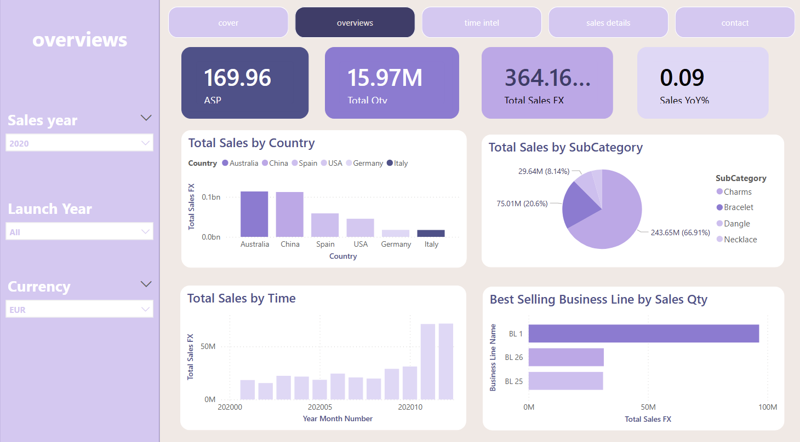

# 💎 Jewellery Sales Dashboard

Interactive business intelligence dashboard built using **MySQL + Power BI** to analyze global jewellery sales performance across regions, time, and product categories.

🔗 **Live Dashboard:**
*https://app.powerbi.com/groups/me/reports/13cb3d6e-8c47-44e8-bfa4-9d5fb6c92a33/f897ee79ea80f12536ad?experience=power-bi*

---

## 🧠 What I Did
- Cleaned and prepared raw transactional data using **MySQL**  
- Transformed and engineered features using **DAX** (including column splitting & calculated measures)  
- Built a structured data model using **star schema** design  
- Implemented **time intelligence metrics** (YTD, YoY, MoM)  
- Designed interactive Power BI dashboard for KPI and product performance analysis  

---

## 📊 Key Insights

* China & Australia generate the highest revenue
* Charms category contributes ~65% of total sales
* Strong seasonal growth in Q4
* High ASP products tend to sell lower volume
* Clear performance gap between top and bottom products

---

## 🛠 Tech Stack

**SQL** | Power BI | DAX | Data Modelling | Dashboard Design

---

## 📷 Preview

